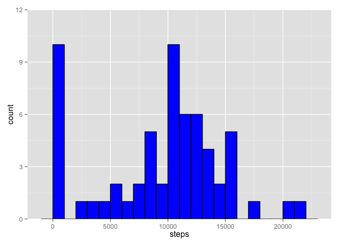
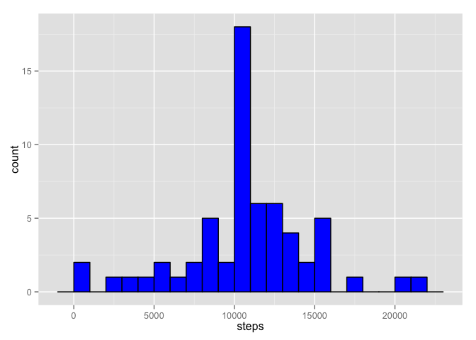
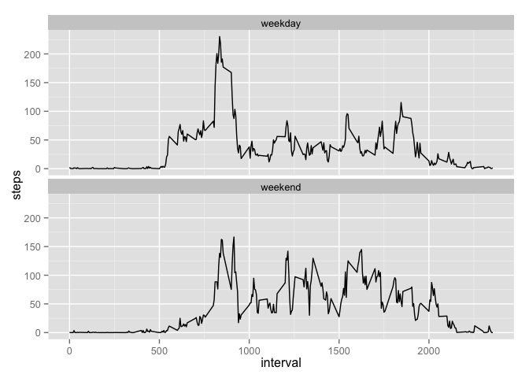

# Reproducible Research: Peer Assessment 1


## Loading and preprocessing the data

First, we are going to unzip and read the data. Then, we convert date variable in to Date format.


```r
if (!file.exists("activity.csv"))
    unzip("activity.zip")

data <- read.csv("activity.csv")
str(data)
```

```
## 'data.frame':	17568 obs. of  3 variables:
##  $ steps   : int  NA NA NA NA NA NA NA NA NA NA ...
##  $ date    : Factor w/ 61 levels "2012-10-01","2012-10-02",..: 1 1 1 1 1 1 1 1 1 1 ...
##  $ interval: int  0 5 10 15 20 25 30 35 40 45 ...
```

```r
summary(data)
```

```
##      steps                date          interval     
##  Min.   :  0.00   2012-10-01:  288   Min.   :   0.0  
##  1st Qu.:  0.00   2012-10-02:  288   1st Qu.: 588.8  
##  Median :  0.00   2012-10-03:  288   Median :1177.5  
##  Mean   : 37.38   2012-10-04:  288   Mean   :1177.5  
##  3rd Qu.: 12.00   2012-10-05:  288   3rd Qu.:1766.2  
##  Max.   :806.00   2012-10-06:  288   Max.   :2355.0  
##  NA's   :2304     (Other)   :15840
```

```r
# Pre-processed data
data.prep <- data
rm(data)

# Reformat date variable
data.prep$date <- as.Date(data.prep$date)
str(data.prep)
```

```
## 'data.frame':	17568 obs. of  3 variables:
##  $ steps   : int  NA NA NA NA NA NA NA NA NA NA ...
##  $ date    : Date, format: "2012-10-01" "2012-10-01" ...
##  $ interval: int  0 5 10 15 20 25 30 35 40 45 ...
```

```r
head(data.prep)
```

```
##   steps       date interval
## 1    NA 2012-10-01        0
## 2    NA 2012-10-01        5
## 3    NA 2012-10-01       10
## 4    NA 2012-10-01       15
## 5    NA 2012-10-01       20
## 6    NA 2012-10-01       25
```

```r
# convert to tbl_df to use dplyr functions
library(dplyr)
```

```
## 
## Attaching package: 'dplyr'
## 
## The following objects are masked from 'package:stats':
## 
##     filter, lag
## 
## The following objects are masked from 'package:base':
## 
##     intersect, setdiff, setequal, union
```

```r
data.prep <- tbl_df(data.prep)
```

## What is mean total number of steps taken per day?

First, we calculate the total number of steps taken per day.

```r
total.steps <- group_by(data.prep, date) %>%
    summarize(steps= sum(steps, na.rm=T))
```

Next, we will plot the histogram of total steps taken per day.


```r
library(ggplot2)
ggplot(data = total.steps, aes(x= steps)) +
    geom_histogram(fill= "Blue", color="Black", binwidth= 1000) +
    coord_cartesian(ylim = c(0, 12))
```

 

Next, we calculate **mean** and **median** steps taken per day.


```r
mean(total.steps$steps)
```

```
## [1] 9354.23
```

```r
median(total.steps$steps)
```

```
## [1] 10395
```

## What is the average daily activity pattern?


```r
interval.steps <- group_by(data.prep, interval) %>%
    summarize(mean= mean(steps, na.rm= T))

ggplot(interval.steps, aes(x= interval, y= mean)) +
           geom_line()
```

 

We would like to know which interval has the maximum number of steps taken, on average.

```r
interval.steps[which.max(interval.steps$mean),]
```

```
## Source: local data frame [1 x 2]
## 
##   interval     mean
##      (int)    (dbl)
## 1      835 206.1698
```

## Imputing missing values

First, let's see how many rows have missing values.


```r
summary(data.prep)
```

```
##      steps             date               interval     
##  Min.   :  0.00   Min.   :2012-10-01   Min.   :   0.0  
##  1st Qu.:  0.00   1st Qu.:2012-10-16   1st Qu.: 588.8  
##  Median :  0.00   Median :2012-10-31   Median :1177.5  
##  Mean   : 37.38   Mean   :2012-10-31   Mean   :1177.5  
##  3rd Qu.: 12.00   3rd Qu.:2012-11-15   3rd Qu.:1766.2  
##  Max.   :806.00   Max.   :2012-11-30   Max.   :2355.0  
##  NA's   :2304
```

As we can see in the results of *summary()* function, **data** column and **interval** column don't have any missing values, but **steps** column has 2304 missing values.

To impute the missing values, we first need to determine the nature of the missingness.


```r
tapply(data.prep$steps, data.prep$date, function(x) {
    sum(is.na(x))
})
```

```
## 2012-10-01 2012-10-02 2012-10-03 2012-10-04 2012-10-05 2012-10-06 
##        288          0          0          0          0          0 
## 2012-10-07 2012-10-08 2012-10-09 2012-10-10 2012-10-11 2012-10-12 
##          0        288          0          0          0          0 
## 2012-10-13 2012-10-14 2012-10-15 2012-10-16 2012-10-17 2012-10-18 
##          0          0          0          0          0          0 
## 2012-10-19 2012-10-20 2012-10-21 2012-10-22 2012-10-23 2012-10-24 
##          0          0          0          0          0          0 
## 2012-10-25 2012-10-26 2012-10-27 2012-10-28 2012-10-29 2012-10-30 
##          0          0          0          0          0          0 
## 2012-10-31 2012-11-01 2012-11-02 2012-11-03 2012-11-04 2012-11-05 
##          0        288          0          0        288          0 
## 2012-11-06 2012-11-07 2012-11-08 2012-11-09 2012-11-10 2012-11-11 
##          0          0          0        288        288          0 
## 2012-11-12 2012-11-13 2012-11-14 2012-11-15 2012-11-16 2012-11-17 
##          0          0        288          0          0          0 
## 2012-11-18 2012-11-19 2012-11-20 2012-11-21 2012-11-22 2012-11-23 
##          0          0          0          0          0          0 
## 2012-11-24 2012-11-25 2012-11-26 2012-11-27 2012-11-28 2012-11-29 
##          0          0          0          0          0          0 
## 2012-11-30 
##        288
```

```r
tapply(data.prep$steps, data.prep$interval, function(x) {
    sum(is.na(x))
})
```

```
##    0    5   10   15   20   25   30   35   40   45   50   55  100  105  110 
##    8    8    8    8    8    8    8    8    8    8    8    8    8    8    8 
##  115  120  125  130  135  140  145  150  155  200  205  210  215  220  225 
##    8    8    8    8    8    8    8    8    8    8    8    8    8    8    8 
##  230  235  240  245  250  255  300  305  310  315  320  325  330  335  340 
##    8    8    8    8    8    8    8    8    8    8    8    8    8    8    8 
##  345  350  355  400  405  410  415  420  425  430  435  440  445  450  455 
##    8    8    8    8    8    8    8    8    8    8    8    8    8    8    8 
##  500  505  510  515  520  525  530  535  540  545  550  555  600  605  610 
##    8    8    8    8    8    8    8    8    8    8    8    8    8    8    8 
##  615  620  625  630  635  640  645  650  655  700  705  710  715  720  725 
##    8    8    8    8    8    8    8    8    8    8    8    8    8    8    8 
##  730  735  740  745  750  755  800  805  810  815  820  825  830  835  840 
##    8    8    8    8    8    8    8    8    8    8    8    8    8    8    8 
##  845  850  855  900  905  910  915  920  925  930  935  940  945  950  955 
##    8    8    8    8    8    8    8    8    8    8    8    8    8    8    8 
## 1000 1005 1010 1015 1020 1025 1030 1035 1040 1045 1050 1055 1100 1105 1110 
##    8    8    8    8    8    8    8    8    8    8    8    8    8    8    8 
## 1115 1120 1125 1130 1135 1140 1145 1150 1155 1200 1205 1210 1215 1220 1225 
##    8    8    8    8    8    8    8    8    8    8    8    8    8    8    8 
## 1230 1235 1240 1245 1250 1255 1300 1305 1310 1315 1320 1325 1330 1335 1340 
##    8    8    8    8    8    8    8    8    8    8    8    8    8    8    8 
## 1345 1350 1355 1400 1405 1410 1415 1420 1425 1430 1435 1440 1445 1450 1455 
##    8    8    8    8    8    8    8    8    8    8    8    8    8    8    8 
## 1500 1505 1510 1515 1520 1525 1530 1535 1540 1545 1550 1555 1600 1605 1610 
##    8    8    8    8    8    8    8    8    8    8    8    8    8    8    8 
## 1615 1620 1625 1630 1635 1640 1645 1650 1655 1700 1705 1710 1715 1720 1725 
##    8    8    8    8    8    8    8    8    8    8    8    8    8    8    8 
## 1730 1735 1740 1745 1750 1755 1800 1805 1810 1815 1820 1825 1830 1835 1840 
##    8    8    8    8    8    8    8    8    8    8    8    8    8    8    8 
## 1845 1850 1855 1900 1905 1910 1915 1920 1925 1930 1935 1940 1945 1950 1955 
##    8    8    8    8    8    8    8    8    8    8    8    8    8    8    8 
## 2000 2005 2010 2015 2020 2025 2030 2035 2040 2045 2050 2055 2100 2105 2110 
##    8    8    8    8    8    8    8    8    8    8    8    8    8    8    8 
## 2115 2120 2125 2130 2135 2140 2145 2150 2155 2200 2205 2210 2215 2220 2225 
##    8    8    8    8    8    8    8    8    8    8    8    8    8    8    8 
## 2230 2235 2240 2245 2250 2255 2300 2305 2310 2315 2320 2325 2330 2335 2340 
##    8    8    8    8    8    8    8    8    8    8    8    8    8    8    8 
## 2345 2350 2355 
##    8    8    8
```

Since the missing values are concentrated in some specific dates, and since the activity levels tend to be different during different times of the day, I would go with the **mean** activity level across **all** the remaining days during that specific **interval** as the imputed values.


```r
# get mean steps count for the same interval, where steps are valid
mean.steps <- filter(data.prep, !is.na(steps)) %>%
    group_by(interval) %>%
    summarize(mean= mean(steps))

# data set to contain original and imputed values
data.imputed <- data.prep

# where are the missing values
missing <- which(is.na(data.imputed$steps))

# get mean steps count for a specific interval
get.mean <- function(x) {
    mean.steps$mean[mean.steps$interval == x]
}

data.imputed$steps[missing] <- sapply(data.imputed$interval[missing], get.mean)
```

Now, we re-create the histogram of number of steps taken per day, with imputed data.

```r
total.steps.imputed <- group_by(data.imputed, date) %>%
    summarize(steps= sum(steps))

ggplot(total.steps.imputed, aes(x= steps)) +
    geom_histogram(fill="blue", color="black", binwidth= 1000)
```

 

Now, we can compare mean and media steps taken per day, before and after imputing data. **Before** imputing data:

```r
mean(total.steps$steps)
```

```
## [1] 9354.23
```

```r
median(total.steps$steps)
```

```
## [1] 10395
```

**After** imputing missing data:

```r
mean(total.steps.imputed$steps)
```

```
## [1] 10766.19
```

```r
median(total.steps.imputed$steps)
```

```
## [1] 10766.19
```

Both mean and median are increased, with mean increasing more.

## Are there differences in activity patterns between weekdays and weekends?

Let's take a look at difference in activity levels during weekdays vs. weekends.

```r
data.imputed <- mutate(data.imputed, weekday= factor(ifelse(weekdays(date) %in% c("Saturday", "Sunday"), "weekend", "weekday")))

ggplot(data.imputed, aes(x= interval, y=steps)) +
    stat_summary(geom="line", fun.y= mean) +
    #geom_line() +
    facet_wrap(~weekday, nrow = 2)
```

 

In the weekends, activities start later and have lower maximum and finish later, on average. But, in general this individual looks more active during the weekends.
